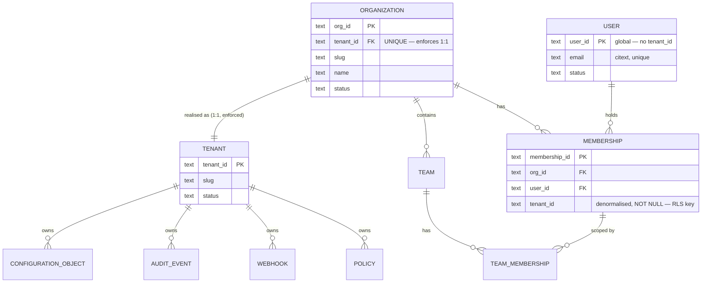
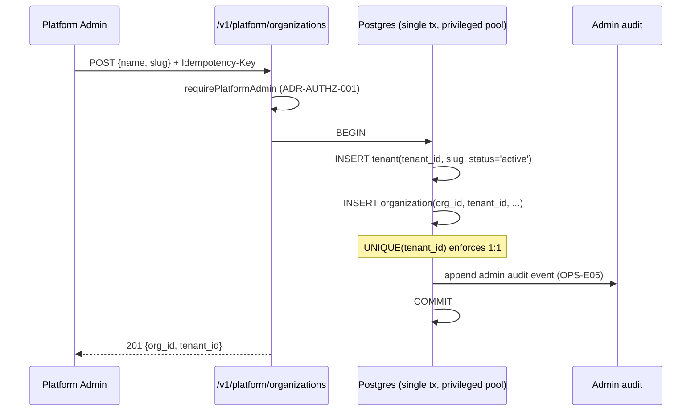
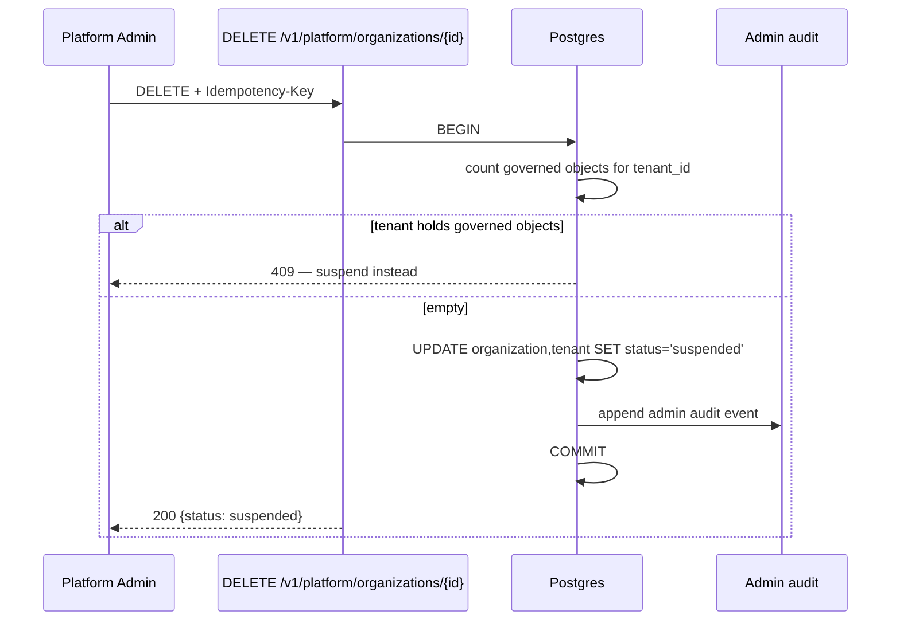

# ADR-IDENTITY-001: An Organisation is an Identity scope; a Tenant is its isolation realisation

| | |
|---|---|
| **Status** | **RATIFIED** |
| **Date** | 2026-07-29 |
| **Author** | Chief Architect |
| **Resolves** | **G-1** — Organisation ↔ Tenant relationship |
| **Gates** | ADR-IDENTITY-002 (G-2), `OPS-S018`, and every Sprint 1 identity migration |
| **Binding on** | `internal/identity`, `internal/organization`, `internal/authz`, every table added to `TenantOwnedTables` |
| **Related** | ADR-TENANCY-001 (row-level isolation), ADR-TENANCY-002 (isolation is a property of wiring), ADR-TENANCY-004 (authoritative ownership must be consistent), ADR-TENANCY-007 (schema invariants validated at startup), ADR-AUTHZ-001 (permission scope and the platform boundary) |

---

# 1. Context

The platform has a working `tenant` table, `tenant_id` on twelve tables, and fail-closed
PostgreSQL row-level security keyed on `current_setting('app.tenant_id')`. It has no
`organization`, no `user`, and no membership.

Sprint 1 must add them. Every identity migration waits on one question: **what is an
Organisation, and how does it relate to the Tenant that already carries isolation?**

Getting this wrong is expensive in a specific way. Twelve tables, eleven ADRs and the entire
RLS model are keyed on `tenant_id`. An Organisation model that competes with that key creates
two answers to "who owns this row" — which is **CMR-D04**, the defect class this programme has
already paid for once with `Authority`.

---

# 2. Problem Statement

**Is an Organisation the same thing as a Tenant, a container of Tenants, or orthogonal to it?**

And, because the brief asks it: where do **Workspace** and **Project** sit?

## 2.1 What the ratified baseline already fixes

This is not an open field. Volume IV Part 9 (constraint **C6**) states:

> *"**Identity-scoped Policy boundaries.** Policy applies consistently across every boundary
> that Identity can scope — **organizational, ownership, domain, and tenancy** boundaries alike
> — enforced at every PEP. **A boundary is simply a scope of Identity to which Policy attaches;
> the architecture assumes nothing about how such boundaries are realized.**"*

Three things follow, and they decide most of this ADR:

1. **"Organizational" and "tenancy" are named as two boundaries of the same kind** — both are
   scopes of Identity. The baseline does not treat them as rival concepts.
2. **A boundary is a scope of Identity to which Policy attaches.** That is the definition. It is
   ratified, and this ADR does not get to write another one.
3. **The realisation is expressly left open.** Choosing it is therefore an engineering decision
   an ADR may record — not a constitutional decision an ADR is forbidden to make (Charter §6.1).

## 2.2 What the ratified baseline forbids

Two of the seven terms in the brief are **not available**, and this was checked rather than
assumed:

| Term | Occurrences in Volumes I–IV | Finding |
|---|---|---|
| **Workspace** | **0** in every ratified volume | Never ratified. Not available as a domain entity. |
| **Project** | Present, but as the semantic **operation** `Project` (Vol III §7), which produces a Projection | Reifying it as a container collides with a ratified operation. |

Volume III is explicit about this failure mode:

> *"**Guarding the language means refusing false nouns.** The following are **not** semantic
> things and must never be reified as such: a *dashboard* (a projection), a *report* (a
> projection), a *ticket* (a projection of a Situation for a workflow) …"*

**Introducing `Workspace` and `Project` as entities would add unratified nouns to the domain
model at the exact moment identity lands.** They appear nowhere in the P0 backlog
(`OPS-E01`–`E20`), so refusing them costs Sprint 1 nothing.

---

# 3. Considered Alternatives

### Alternative A — Organisation **is** the Tenant *(rename, one entity)*

Rename `tenant` → `organization`; one row, one boundary.

- **For:** one key, no ambiguity, no migration of the RLS model.
- **Against:** conflates a **commercial/administrative** entity with an **isolation mechanism**.
  A customer that later needs production/staging separation, or a subsidiary structure, has no
  seam and must re-key twelve tables. It also destroys the ratified distinction at Vol IV C6,
  which names organisational and tenancy boundaries separately.

### Alternative B — Organisation **contains** Tenants *(1:N from the start)*

`organization` as parent, `tenant` as child, `tenant_id` remains the RLS key.

- **For:** matches the ratified separation; the seam exists from day one.
- **Against:** at MVP every organisation would have exactly one tenant, so the second level is
  structure without a payload — and identity queries would carry a join nobody's data needs yet.
  It also forces an answer now to questions with no evidence behind them: does a user belong to
  the org or the tenant? Does a role granted at org level inherit down?

### Alternative C — Organisation orthogonal to Tenant

Two independent scopes; membership in each resolved separately.

- **Against:** two authoritative owners for one row. **This is CMR-D04 by construction** and is
  rejected on that ground alone.

### Alternative D — Organisation is the Identity scope; Tenant is its isolation realisation, **1:1 and enforced**

One `organization` row, one `tenant` row, a `UNIQUE` constraint holding them 1:1. `tenant_id`
remains the sole RLS key and the sole answer to "who owns this row". The seam to 1:N exists in
the schema but is closed by constraint, not by absence.

- **For:** honours Vol IV C6's separation without paying for a level nobody uses; keeps exactly
  one ownership key, so CMR-D04 cannot recur; widening later is dropping a constraint, not
  re-keying twelve tables.
- **Against:** two rows where one would do at MVP. Accepted — the cost is one row per customer
  and one join on the administrative path only.

---

# 4. Final Decision

## **Alternative D.**

> **An Organisation is a scope of Identity to which Policy attaches. A Tenant is the
> realisation of that scope as an isolation boundary. They stand 1:1, enforced by constraint.
> `tenant_id` remains the single authoritative ownership key for every row in the platform.**

## 4.1 The seven terms, decided

| Term | Decision |
|---|---|
| **Organisation** | The commercial and administrative entity. A **scope of Identity** (Vol IV C6). Owns nothing directly; **carries no data rows.** |
| **Tenant** | The **isolation realisation** of exactly one Organisation. `tenant_id` is the sole RLS key and the sole ownership key. Unchanged from today. |
| **Identity** | Ratified Vol II primitive. **Not redefined here.** An authenticated principal that scopes to a boundary. |
| **User** | A **person-shaped Identity**, global to the platform, joined to Organisations by membership. Not tenant-scoped — see §8.2. |
| **Policy** | Ratified primitive. Attaches to a boundary (Vol IV C6). Remains tenant-scoped as today; the existing `policy` table is untouched. |
| **Workspace** | ⛔ **REFUSED.** Zero occurrences in any ratified volume. Not introduced. |
| **Project** | ⛔ **REFUSED as a noun.** `Project` is a ratified **operation** (Vol III §7). Reifying it as a container is the "false noun" Vol III forbids. |

**Where sub-organisation grouping is needed, the answer is `Team`** — already in the approved
backlog (`OPS-E06`), and an Identity scope under Vol IV C6 like any other. **No new container
concept is created by this ADR.**

## 4.2 The load-bearing invariant

> **One row has exactly one owner, and that owner is `tenant_id`.**

Nothing in the identity model may introduce a second answer to row ownership. Organisation
membership answers *what a principal may do*; it never answers *who owns this row*.

---

# 5. Consequences

## 5.1 Accepted

- One extra row per customer (`organization` + `tenant`) and one join on administrative paths.
- The 1:1 constraint must be dropped deliberately to reach 1:N. **That is the point** — it makes
  widening a decision with a migration, not an accident.
- `User` is global, so a user row is visible outside RLS. Consequences at §9.2.

## 5.2 Rejected consequences — what this decision prevents

- **No second ownership key.** CMR-D04 cannot recur through identity.
- **No re-keying of twelve tables** if multi-tenant-per-org is later required.
- **No unratified nouns** added to the domain model.

## 5.3 What is deliberately not decided here

Nothing that Sprint 1 needs. Two items are **assigned, not deferred**:

- **Effective-permission precedence** across org → team → user → resource is `OPS-E08` /
  `OPS-S049`, and §4.2 binds it: resolution answers permission, never ownership.
- **Which identity tables are tenant-scoped vs global** is **ADR-IDENTITY-002 (G-2)**, whose
  answer is now determined by §8.2 of this ADR rather than open.

---

# 6. Domain Model



**`membership.tenant_id` is denormalised deliberately.** It is derivable from `org_id`, but RLS
policies are `USING (tenant_id = current_setting('app.tenant_id', true))` — a policy that had to
join to reach the key would be both slower and a second path to ownership. **The column is the
key; the FK to `organization` is the relationship.** A startup invariant (§12, AC-7) proves they
never disagree.

---

# 7. Sequence Diagrams

## 7.1 Organisation creation — one transaction, two rows



**Both rows or neither.** An organisation without its tenant is an Identity scope with no
isolation — it must not be reachable, so the two inserts share one transaction.

## 7.2 Request authorisation — Identity to isolation

```mermaid
sequenceDiagram
    participant C as Client
    participant MW as authenticate → authorize
    participant R as Resolver
    participant DB as Postgres (tenant pool)

    C->>MW: request + bearer token
    MW->>MW: verify OIDC (RS256/JWKS)
    MW->>R: subject + requested org
    R->>DB: membership for (user, org) → tenant_id
    alt no membership
        R-->>C: 403
    else membership found
        R->>MW: tenant_id + effective permissions
        MW->>DB: SET LOCAL app.tenant_id = <tenant_id>
        Note over DB: RLS fail-closed; NULL setting matches no row
        MW->>DB: execute request
        DB-->>C: rows for that tenant only
    end
```

**The session variable is set from the resolved membership, never from the request.** A
client-supplied tenant identifier is a claim; the membership is the fact — ADR-TENANCY-004
applied to identity.

## 7.3 Organisation deletion



---

# 8. Data Ownership

## 8.1 The ownership rule

| Question | Answered by |
|---|---|
| **Who owns this row?** | `tenant_id`. Always. Only. |
| What may this principal do? | Effective permissions over org/team/user grants |
| Which isolation boundary applies? | The Tenant realising the principal's Organisation |

## 8.2 Table placement — this determines ADR-IDENTITY-002

| Table | Placement | Reason |
|---|---|---|
| `organization` | **Global** | The mapping *to* a tenant cannot itself be tenant-scoped without a chicken-and-egg at resolution time |
| `tenant` | **Global** | Already global today. Unchanged |
| `user` | **Global** | A person exists before, and independently of, any membership. Email uniqueness is platform-wide |
| `membership` | **Tenant-scoped** | Carries `tenant_id`; joins `TenantOwnedTables` |
| `team`, `team_membership` | **Tenant-scoped** | Sub-scopes of one organisation; join `TenantOwnedTables` |
| `role`, `grant`, `role_assignment` | **Tenant-scoped** | Grants are meaningful only inside a boundary |
| `invitation` | **Tenant-scoped** | Issued by an organisation |
| `session`, `api_key` | **Tenant-scoped** | Bound to the membership that authorised them |

**Only `organization`, `tenant` and `user` are global. Everything else joins
`TenantOwnedTables`** — which means the existing registry-derived guards
(`TestPrivilegedMutations_AreScopedToAnOwner`, the RLS bootstrap loop) cover them the moment
they are added, with no guard change. That is ADR-TENANCY-002 — *isolation is a property of
wiring* — collected rather than restated.

## 8.3 Lifecycle

| Entity | States | Transitions |
|---|---|---|
| **Organisation** | `active` → `suspended` | Suspension cascades to its Tenant. **No hard delete while governed objects exist** |
| **Tenant** | `active` → `suspended` | Already constrained by `ck_tenant_status`. Unchanged |
| **User** | `invited` → `active` → `suspended` → `deactivated` | Global. Deactivation revokes every membership; the user row survives for audit attribution |
| **Membership** | `active` → `revoked` | Revocation is a state change, never a delete — the audit chain must outlive it |

## 8.4 Inheritance

**Permissions inherit downward. Ownership does not inherit at all.**

```
Organisation grant  →  applies to every Team and Member in it
Team grant          →  applies to every Member of that Team
User grant          →  applies to that Member only
```

Deny is not expressible at MVP; absence of a grant is denial. Precedence among grants is
`OPS-E08`'s to fix, constrained by §4.2.

---

# 9. Security Implications

## 9.1 Preserved

- **RLS remains fail-closed.** `current_setting('app.tenant_id', true)` returning NULL matches
  no row, and the migration's own comment records why the `OR ... IS NULL` alternative was
  refused. Identity tables adopt the same policy.
- **`FORCE ROW LEVEL SECURITY` still applies** — verified present in the bootstrap loop.
- **Platform/tenant boundary intact.** Organisation administration is a *platform* operation and
  requires `requirePlatformAdmin` (ADR-AUTHZ-001). A tenant administrator cannot create,
  suspend or enumerate organisations.

## 9.2 Introduced, and bounded

| Risk | Bound |
|---|---|
| **`user` is global**, so a platform-level read sees every user | The table holds `user_id`, `email`, `status` and no tenant data. Reachable only through the privileged pool, which every privileged mutation guard already covers |
| **Email enumeration** across organisations | Invitation responses must not disclose whether an email is already registered — AC-9 |
| **A user in two organisations** could carry state across a boundary | Impossible by construction: `SET LOCAL app.tenant_id` is per-transaction and derived from the single resolved membership. Two memberships never resolve in one transaction |
| **Membership is the authorisation fact** | It is tenant-scoped and RLS-protected like any governed row; it cannot be forged through the tenant pool |

## 9.3 Audit

Every organisation, membership and user mutation is a **privileged administrative act** and
writes to the admin audit trail (`OPS-E05`). This ADR does not create a second audit mechanism —
the measured 0-event gap is `OPS-E05`'s to close, and identity is its first and largest consumer.

---

# 10. Migration Strategy

**Expand → migrate → contract. Every step reversible; no destructive change in the release that
introduces its replacement.**

| # | Migration | Content | Reversible |
|---|---|---|---|
| **M1** | `organization` | Table; `tenant_id` FK **`UNIQUE NOT NULL`**; slug constraint mirroring `ck_tenant_slug` | ✅ drop table |
| **M2** | Backfill | One `organization` per existing `tenant`, `slug`/`name` copied. **Idempotent** — `INSERT … ON CONFLICT DO NOTHING` | ✅ delete backfilled rows |
| **M3** | `user` | Global table; `citext` email, unique | ✅ drop table |
| **M4** | `membership`, `invitation` | With `tenant_id NOT NULL`; registered in `TenantOwnedTables` in the same change | ✅ drop tables |
| **M5** | RLS | Add the identity tables to the bootstrap loop | ✅ drop policies |
| **M6** | Invariant | `OrganizationTenantValidator` registered in `platformInvariants` | ✅ unregister |

**The system tenant.** The platform today resolves unmapped requests to a system tenant. M2
gives it an organisation like any other — no special case, so no branch in the resolution path.

**Rollback.** Each migration ships its `rollback/` counterpart, as every migration in this
repository already does. M2 is idempotent and re-runnable.

---

# 11. Impacted Components

| Component | Change |
|---|---|
| `internal/store/migrate/sql` | M1–M6 |
| `internal/store/postgres/tenant_tables.go` | `membership`, `team`, `team_membership`, `role`, `grant`, `role_assignment`, `invitation`, `session`, `api_key` |
| `internal/organization` | **New.** Organisation + membership |
| `internal/identity` | **New.** User + invitation |
| `internal/authz` | **New.** Effective permissions (`OPS-E08`) |
| `internal/httpapi` | `/v1/identity/*`, `/v1/platform/organizations/*`; **`openapi.yaml` must be updated in the same commit** — the contract guard fails the build otherwise |
| `internal/ops` | `OrganizationTenantValidator` in `platformInvariants` |
| `internal/auth` | Resolve `tenant_id` from membership, not from the request |
| `sdk/` | Hand-written; extend for the new endpoints |

**Unchanged:** `internal/domain`, `internal/governance`, `internal/audit`, `internal/events`,
`internal/policy`, `internal/graph`. **No governed-object code is touched by this ADR** —
`tenant_id` keeps its meaning, so nothing above it needs to know identity arrived.

---

# 12. Acceptance Criteria

| # | Criterion | Verified by |
|---|---|---|
| **AC-1** | Every organisation has exactly one tenant and every tenant one organisation | `UNIQUE NOT NULL` on `organization.tenant_id`; integration test asserting the second insert fails |
| **AC-2** | Creation is atomic — no organisation without its tenant | Integration test: induced failure after the tenant insert leaves **zero** rows |
| **AC-3** | **A user cannot read or mutate another organisation's data** | Integration test that **attempts the breach** and asserts it fails (`OPS-S024`) |
| **AC-4** | `tenant_id` is the only ownership key; no second owner column exists | Architecture guard forbidding an `org_id` column on any `TenantOwnedTables` member |
| **AC-5** | Every new identity table is in `TenantOwnedTables` and RLS-protected | Existing registry-derived guards, unmodified |
| **AC-6** | `app.tenant_id` is set from the resolved membership, never from the request | Architecture guard: no handler passes a request-derived tenant to `SET LOCAL` |
| **AC-7** | `membership.tenant_id` always equals its organisation's tenant | `OrganizationTenantValidator`, boot gate **and** continuous sentinel |
| **AC-8** | Organisation administration requires platform admin | Existing route-derived guard extends automatically |
| **AC-9** | Invitation responses do not disclose whether an email is registered | Integration test comparing responses for known and unknown addresses |
| **AC-10** | Every organisation, membership and user mutation writes one admin audit event | Integration test asserting a delta of exactly 1 |
| **AC-11** | Migrations apply and roll back on a **populated** database | Migration test |
| **AC-12** | **No `workspace` or `project` table or type is introduced** | Architecture guard over the migration directory and domain package |

**AC-4, AC-6 and AC-12 are new guards.** Each must be mutation-tested in both directions before
merge — revert the fix and it must fail; break the detector and it must fail as vacuous, never
pass by finding nothing.

---

# 13. Authority

This ADR **records an engineering realisation of ratified text**; it makes no constitutional
decision, which Charter §6.1 forbids an ADR to do.

- **Vol IV Part 9 C6** supplies the definition of a boundary and expressly leaves realisation open.
- **Vol III** supplies the prohibition on false nouns, applied to Workspace and Project.
- **ADR-TENANCY-001/002/004** supply the isolation model, which is extended, not replaced.

**No frozen text is altered. No ratified vocabulary is added. `tenant_id` keeps its meaning.**

---

**STATUS: RATIFIED**
